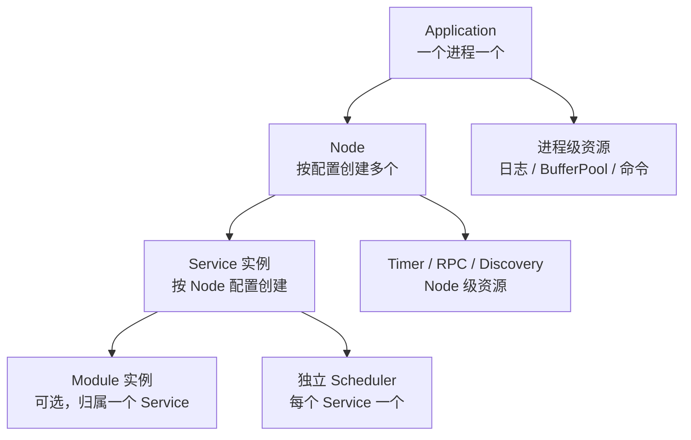
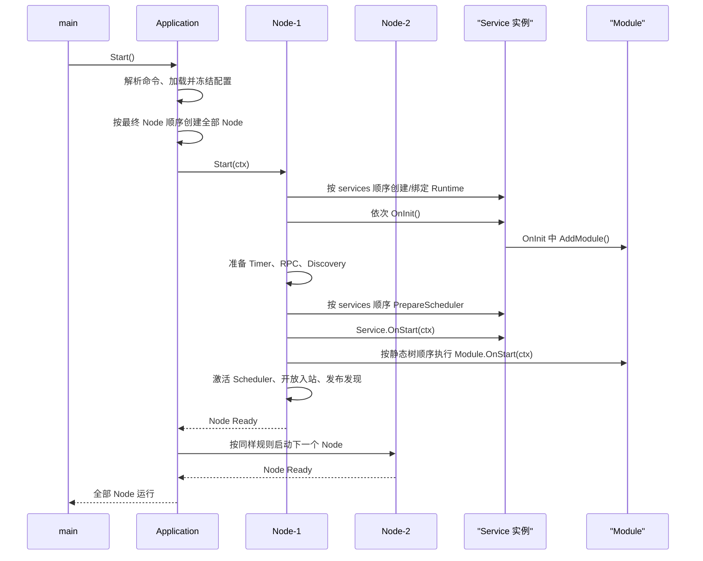

# 01：创建第一个应用

## 我想启动多个 Node

运行两个 Node、两个 Service：

```text
REM 启动包含两个 Node 的示例。
examples\01-first-application\01-application-node-service\run.bat
```

完整源码：[examples/01-first-application/01-application-node-service](../../../../examples/01-first-application/01-application-node-service)。

配置中每个 Node 只声明实际要运行的 Service：

```yaml
nodes:
  # gateway-1 只创建网关 Service 实例。
  - id: gateway-1
    services: [GatewayService]
  # game-1 只创建玩家 Service 实例。
  - id: game-1
    services: [PlayerService]
```

## 我想确认启动和停止顺序

运行：[examples/01-first-application/02-lifecycle-order](../../../../examples/01-first-application/02-lifecycle-order)。按 `Ctrl+C` 后，`SecondService` 会先停止，`FirstService` 最后停止。

## 我想在创建 Application 时覆盖运行选项

运行：[examples/01-first-application/03-application-options-and-command](../../../../examples/01-first-application/03-application-options-and-command)。其中 `run.bat`/`run.sh` 运行一个自定义离线命令；`run-start.bat`/`run-start.sh` 则按普通方式启动 Application。

绝大多数程序只需要：

```go
// 零值 Options 使用全部默认值；这是最常见的入口。
var app = application.New()
```

`New` 只能省略 Options 或传入**一份** `application.Options`。它不接收 YAML/JSON 业务配置；配置仍由 `start --config` 加载。需要调整框架级边界时，在程序入口集中设置：

```go
var app = application.New(application.Options{
    // 0 表示框架不额外设置 Deadline；正数限制整个 Node 启动阶段。
    StartTimeout: 30 * time.Second,
    // 0 同样表示不额外限制完整停止阶段。
    StopTimeout: 45 * time.Second,
    Timer: application.TimerOptions{
        // 每个 Node 内所有 Service 合计的活跃业务 Timer 上限。
        // 0 使用默认 3,000,000；负数无效。
        MaxTimersPerNode: 10_000,
        // Cron 的统一时区；nil 使用创建 Application 时的 time.Local。
        Location: time.UTC,
    },
})
```

可用字段与默认值如下。Options 创建后不应再修改；`New` 返回值没有 error，非法负数、传入多份 Options 等错误会在 `Start` 的统一启动路径中报告。

| 字段 | 默认值 | 用途 |
| --- | --- | --- |
| `StartTimeout` | `0`（不额外超时） | 限制全部选中 Node 的完整启动阶段。 |
| `StopTimeout` | `0`（不额外超时） | 限制框架发起的完整停止、资源关闭阶段。 |
| `Timer.MaxTimersPerNode` | `3,000,000` | 每个 Node 的全部 Service 共享的活跃业务 Timer 硬上限；不会预分配同等数量内存。 |
| `Timer.Location` | `time.Local` | 该 Application 中所有 Cron 表达式使用的时区。 |
| `LogHandlerFactory` | `nil`（内置 Zap） | 替换日志输出后端的高级扩展点。常规控制台、文件、滚动等需求应优先使用 YAML/JSON 日志配置。 |

### 启动和停止超时怎么设

| 设置 | 设为正数 | 设为 `0` |
| --- | --- | --- |
| `StartTimeout` | 限制本次 Application 中所有选中 Node 完成启动的总时间 | 不设置 Application 级启动总超时 |
| `StopTimeout` | 限制所有 Node、Service 和底层资源完成停止的总时间 | 不设置 Application 级停止总超时 |

`StartTimeout` 到期时，框架取消启动等待，本次启动返回错误，Application 不进入 `Running`；已经启动的 Node/Service 会按反序回滚并关闭资源。这是所有选中 Node 共享的一份总预算，不是每个 Node 或 `OnStart` 各得一份。

`StopTimeout` 到期时，框架取消可控的等待，继续能安全完成的本地清理，并返回停止超时错误。这也是一份共享的总预算，不会为每个 Service 重新计时。

配置 `0` 只表示“不限制 Application 整体启动/停止时长”，不会取消单次 RPC、`AwaitXxx`、数据库或 HTTP 请求自己的超时。生产环境通常建议为两者设置有限值。

Go 无法强行终止一个忽略 Context 的 goroutine。因此 `OnStart(ctx)`、`OnStop(ctx)` 和其中调用的外部 I/O 仍应传递并响应 Context；否则即使超时已到，框架也不能把该业务函数强行停掉。

### 我想替换日志 Handler

只有项目确实需要接入自己的日志 Handler 时才设置 `LogHandlerFactory`。Factory 接收已经合并完成的 `log.Config`，并返回 `log.Handler`；Origin 仍负责异步队列、调用方定位、Flush 与 Close：

```go
var app = application.New(application.Options{
    LogHandlerFactory: func(cfg originlog.Config) (originlog.Handler, error) {
        // 这里替换为项目自己的 Handler 构造函数。
        // 不要自行启动第二套日志 Runtime。
        return newProjectLogHandler(cfg)
    },
})
```

`LogHandlerFactory` 是日志后端扩展点，与 `StartTimeout`、`StopTimeout` 没有关系。常规的日志级别、格式、文件输出和滚动不需要编写 Factory，直接使用 YAML/JSON 配置即可。

### 其他 Options 到哪里继续学习

`Timer` 的日常使用、Ticker 和 Cron 示例见 [05：Timer、Event 与执行](./05.timer-event-and-execution.md)；日志 YAML/JSON、文件输出和滚动见 [03：日志输出与管理](../../../maintenance/v3.1/guides/03.logging.md)。

## 我想注册一个自定义命令

自定义命令适合一次性的离线任务，例如校验导入文件、生成预览、执行数据修复前检查。它不创建 Node、不取得 PID 运行锁，也不会连接发现服务或启动业务 Service；持续运行的业务仍应使用 `start`。

在 `app.Start()` 前注册即可：

```go
func init() {
    app.Setup(&ExampleService{})

    if err := app.RegisterCommand(command.Command{
        // 名称必须是小写 kebab-case，不能覆盖 start、retire、resume、stop、help、version。
        Name:    "print-options",
        Summary: "输出离线任务收到的参数",
        Usage:   "demo print-options [name]",
        Run: func(ctx command.Context, args []string) error {
            // 使用 ctx.Stdout/ctx.Stderr，便于测试、嵌入和命令行重定向。
            _, err := fmt.Fprintf(ctx.Stdout, "args=%v\\n", args)
            return err
        },
    }); err != nil {
        panic(err) // 注册错误属于程序装配错误，应在进程启动前立即暴露。
    }
}
```

运行后可从总帮助中看到它，并取得子命令说明：

```text
demo help
demo help print-options
demo print-options Alice
```

自定义命令得到的 `command.Context` 包含取消信号以及 `Stdin`、`Stdout`、`Stderr`。命令回调返回 error 或 panic 时退出码为 `1`；名称、用法或参数错误使用稳定的用法错误退出码。不要在自定义命令中直接复用正在运行 Application 的控制能力；首版的命令模型只面向当前进程的离线工作。

## Application 公开方法应在哪里调用

下表汇总业务项目实际会接触到的 `Application` 方法。除 `Start` 外，方法均可在持有具体 `*application.Application` 的程序入口、管理 Service 或受控后台任务中调用；普通业务 Service 通过 `s.Application()` 只能得到受限诊断外观，详见 [10：Admin 管理 HTTP、Diagnostics 与 pprof](../../../maintenance/v3.1/guides/10.admin-diagnostics-and-pprof.md)。

| 方法 | 合适的调用位置 | 教程 |
| --- | --- | --- |
| `Setup`、`RegisterCommand`、`RegisterDiscoveryProvider` | 程序装配阶段，首次命令执行前 | 本章；Provider 见 [08：服务发现](./08.discovery.md) |
| `Start` | `main`，每个 Application 仅一次 | [00：快速入口](./00.quickstart.md) |
| `Stop(ctx)` | 嵌入式宿主或明确的进程管理代码；正常 CLI 优先使用 `stop` 命令或 OS 信号 | 本节下文 |
| `State`、`Node(id)`、`Nodes`、`Logger` | 管理/观测代码；`Nodes` 返回独立 Slice 快照 | [10：Admin、Diagnostics 与 pprof](../../../maintenance/v3.1/guides/10.admin-diagnostics-and-pprof.md) |
| `Retire(ctx)`、`Resume(ctx)` | 管理 Service 或发布编排 | [09：Retire 与 Resume](./09.retire-and-resume.md) |
| `Diagnostics`、`DiagnosticsSummary`、Admin HTTP 与 pprof 方法 | 受控观测和按需诊断 | [10：Admin、Diagnostics 与 pprof](../../../maintenance/v3.1/guides/10.admin-diagnostics-and-pprof.md) |

`Stop(ctx)` 请求唯一的生命周期路径停止，并等待全部资源清理完成；同时等待本次生命周期的
调用方会得到同一最终结果。Application 已进入 `Stopped` 或 `Failed` 后，再次调用 `Stop`
按幂等成功返回。它适合 Application 被其他 Go 程序嵌入时的显式关闭：

```go
// 在外部管理协程中请求停止；Context 决定当前调用方最多等待多久。
stopCtx, cancel := context.WithTimeout(context.Background(), 30*time.Second)
defer cancel()
if err := app.Stop(stopCtx); err != nil {
    reportStopError(err)
}
```

不要从普通 Service 的 RPC 或回调中随意调用 `Stop`；这会把局部业务失败升级为整个进程退出。若确有管理 Service 需要停止进程，应通过明确的管理入口发起，并在 Service Task 中用 `Await` 等待可能阻塞的 `Stop`，避免独占该 Service 的串行执行权。

## 我想让二进制携带版本、提交和构建时间

这不是新的“杂项”功能：它直接服务于 `version` 与 `help` 命令，因此归在 Application 入口。运行中的程序可使用 `buildinfo.Version()`、`buildinfo.Commit()` 和 `buildinfo.BuildTime()` 读取三项只读字符串；未在编译时注入时它们保持空值，框架不会伪造时间或版本。

可先运行：[examples/01-first-application/04-build-information](../../../../examples/01-first-application/04-build-information)。它以固定演示值编译并执行 `version`，方便先观察最终外观；实际项目再替换为后文的 CI/Git 值。

```go
// 例如在进程级启动日志、诊断适配器中读取构建身份。
target.Logger().Info(fmt.Sprintf(
    "build version=%q commit=%q time=%q",
    buildinfo.Version(),
    buildinfo.Commit(),
    buildinfo.BuildTime(),
))
```

正常用户通常不需要在业务代码中输出它们：编译后的 `program version` 会显示 `version`、
`commit`、`build_time` 与 Go 版本；`program help` 仅在 `BuildTime` 非空时显示构建时间。

### 以 PowerShell 编译 Windows 二进制

将下面的包路径替换为你的 `main` 包，例如 `./cmd/game`。三项值可来自 CI 的发布版本、
Git 提交和构建时间；`-X` 的左侧必须保持 Origin 的完整包路径及变量名不变。

```powershell
$buildTime = Get-Date -Format 'yyyy-MM-ddTHH:mm:ssK'
$version = 'v3.0.0-rc.1'
$commit = (git rev-parse --short HEAD)
$ldflags = @(
  "-X=github.com/duanhf2012/origin/v3/buildinfo.buildTime=$buildTime",
  "-X=github.com/duanhf2012/origin/v3/buildinfo.version=$version",
  "-X=github.com/duanhf2012/origin/v3/buildinfo.commit=$commit"
) -join ' '

go build -ldflags $ldflags -o ./bin/game.exe ./cmd/game
./bin/game.exe version
```

Linux/macOS Shell 的等价方式：

```bash
build_time=$(date '+%Y-%m-%dT%H:%M:%S%z')
version=v3.0.0-rc.1
commit=$(git rev-parse --short HEAD)
go build \
  -ldflags "-X=github.com/duanhf2012/origin/v3/buildinfo.buildTime=$build_time \
  -X=github.com/duanhf2012/origin/v3/buildinfo.version=$version \
  -X=github.com/duanhf2012/origin/v3/buildinfo.commit=$commit" \
  -o ./bin/game ./cmd/game
./bin/game version
```

本仓库的 [`scripts/buildwin.bat`](../../../../scripts/buildwin.bat) 与
[`scripts/buildlinux.bat`](../../../../scripts/buildlinux.bat) 已实现同一套注入规则：自动读取
本地时间、精确 Git Tag 和短 Commit，也允许通过 `ORIGIN_BUILD_TIME`、
`ORIGIN_BUILD_VERSION`、`ORIGIN_BUILD_COMMIT` 覆盖。它们是 Origin 源码仓库的构建脚本；业务
项目应在自己的 Makefile、CI 或构建脚本中复用上面的 `-ldflags` 规则，并将值固定在一次构建内。

## 深入一点：对象关系与 Application 生命周期

### 四层对象关系



- `Application` 是进程级总协调者，持有配置、全部 Node、日志、命令和共享资源。
- `Node` 是一个配置和运行边界；一个 Application 可以有多个 Node，每个 Node 有自己的网络身份、Timer 资源、RPC/发现状态和 Service 集合。
- `Service` 是真正承载业务代码和串行执行权的实例。相同的 Go 类型可以在多个 Node 上创建多个相互独立的实例。
- `Module` 是 Service 内部的生命周期单元，不是独立 Node，也不会单独出现在发现目录中；它只能归属于一个 Service。

### `HelloService{}` 如何变成 Node 内的运行实例

`app.Setup` 登记的是 Go 类型模板，不是所有 Node 共享的业务对象：

```go
var app = application.New()

func init() {
    // 登记类型模板；框架不会把这个模板实例直接共享给多个 Node。
    app.Setup(&HelloService{})
}
```

配置决定在哪些 Node 创建它：

```yaml
nodes:
  - id: hello-1
    services: [HelloService]
  - id: hello-2
    services: [HelloService]
```

启动时，框架读取 `HelloService` 模板的 Go 类型，为每个配置命中的 Node 创建独立业务实例，
因此会得到 `hello-1/HelloService` 和 `hello-2/HelloService` 两个实例。它们不共享 Service
字段、Scheduler、Timer、Module 或生命周期状态；共享的只有 Go 类型定义和 Application 级资源。
配置使用 `actual-name:TemplateName` 时，左侧是实例的实际名称，右侧是用于查找 Go 模板和 RPC
契约的名称。

### Application 与 Node 的启动顺序

`app.Start()` 进入 `start` 命令后，Application 先加载并合并配置，再在执行任何业务生命周期
回调前创建全部选中的 Node 和 Service 实例。Node 的选择顺序是：没有 `--node` 时使用配置
文件中 `nodes` 的顺序；指定 `--node a,b` 时使用命令行中列出的顺序。



Node 内部有几个容易误解的顺序点：

1. 先让该 Node 的全部 Service 完成 `OnInit`；其中可注册 Module、事件监听器、客户端和静态配置，但不应依赖已经运行的远端业务。
2. 全部 `OnInit` 成功后，Node 才启动时间轮、网络和发现准备。随后 `OnStart` 可以使用框架提供的生命周期 Context，并在需要时等待其他服务的 RPC 或发现。
3. `OnStart` 仍按 `services` 列表顺序串行进入。对于每个 Service，先执行 `Service.OnStart`，再按父先子后、同级注册顺序执行 Module 的 `OnStart`；整棵对象树成功后才进入下一个 Service。
4. 全部 `OnStart` 成功后，框架统一把 Service 置为 `Running`，激活 Scheduler、开放入站 RPC，并发布完整发现快照，Node 才进入 `Ready`。运行期批量退休与恢复使用第 09 章的 `retire/resume` 命令。
5. Application 完成前一个 Node 后，才按最终选择顺序启动下一个 Node；所以多 Node 启动不是所有 Node 的 `OnStart` 并发执行。

### 停止和失败回滚

按 `Ctrl+C`、`stop` 命令或显式 `Application.Stop(ctx)` 后，Application 按 Node 的实际启动顺序
倒序停止；Node 内再按 Service 启动顺序倒序停止。下面列的是**真实执行顺序**，不是对象层级：

```text
1. Node-2 停止
   1.1 后启动的 Service 先停止
       1.1.1 该 Service 的 Module 按启动顺序严格逆序执行 OnStop
       1.1.2 最后执行该 Service.OnStop
   1.2 继续停止前一个 Service
2. Node-1 按相同规则停止
```

单个 Service 与 Module 的完整顺序可以记成：

```text
启动：Service.OnStart → Module.OnStart（父到子、同级注册顺序）
停止：Module.OnStop（严格逆序、子到父）→ Service.OnStop
```

框架按“是否已经进入 `OnStart`”判断清理责任，而不是按“`OnStart` 是否返回成功”判断：

| 失败位置 | 回滚行为 |
| --- | --- |
| `Service.OnInit` | Service 和 Module 都没有进入 `OnStart`，因此不调用它们的 `OnStop`。 |
| `Service.OnStart` | 不启动任何 Module，也不调用 `Module.OnStop`；但 Service 已经进入过 `OnStart`，因此调用一次 `Service.OnStop`。 |
| `Module.OnStart` | 失败 Module 自身和此前进入过 `OnStart` 的 Module 严格逆序执行 `OnStop`，最后调用 `Service.OnStop`。 |

这样即使 `Service.OnStart` 在创建部分资源后返回错误，`Service.OnStop` 仍有机会关闭已经交给
Service 持有的资源；尚未转交给 Service 的局部临时资源，应由 `OnStart` 自己使用 `defer` 或
错误分支清理。Application 随后按倒序回滚此前已经 Ready 的 Node，不会把未成功启动的 Node
当作可运行对象留下。一次启动失败后的 Node/Application 不能原地重新启动，应修复配置或进程
依赖后重新创建 Application。

Service 的 `OnInit`、`OnStart`、`OnStop` 分别适合读取配置/登记资源、创建 Service 级共享资源、
最后关闭共享资源。不要在 `OnInit` 发起依赖其他 Service 的 RPC；应在 `OnStart` 或后续任务中进行。
Module 的精确父子生命周期、能力委托和资源归属见 [04：Service 与 Module](./04.service-and-module.md)。
